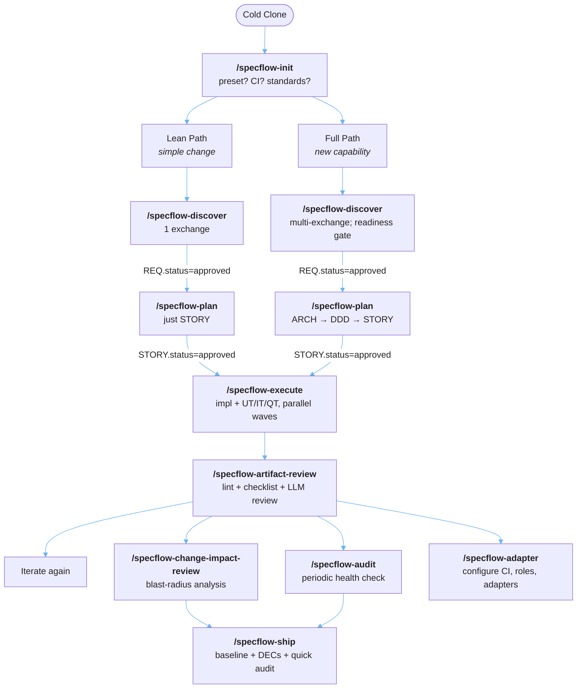

# SpecFlow 🚀

Compliance-grade spec tracking, without the portal.

*Why it matters* · *How it works*

May 7, 2026

  

    
    GitHub Repo
    <a href="https://github.com/Longhuiberkeley/specflow" class="text-xs text-blue-400 hover:text-blue-300">github.com/Longhuiberkeley/specflow</a>
  

  

    
    Presentation Slides
    <a href="https://longhuiberkeley.github.io/specflow_why/" class="text-xs text-blue-400 hover:text-blue-300">longhuiberkeley.github.io/specflow_why</a>
  

<!--
This is the title slide.
-->

---
layout: center
---

# 📚 Why I Built Another Spec-Driven Framework

I like the idea of doing Spec-Driven R&D

- **Feel Closer to the tools I use**: I don't know how the other frameworks are built, from the ground up 
- **Too MANY commands**: BMAD's default has AROUND 50 `/slash-command`. A bit confusing to me 
- **Spec-driven** isn't SPEC-ing ENOUGH and CORRECTLY*
- I want to make the **production level codebase** easier
- **Why not.** If Garry Tan can make a gstack, I can make one too 

---
layout: default
---

# 🧠 The Cognitive Shift: AI & Process

LLM coding is making us **SUPER FAST**. It offloads massive amounts of cognitive responsibility.

- **We are moving too fast**: We don't have the time to reflect, learn, or catch mistakes at the speed AI generates code. 
- **Focus on the Process, not the People**: Because the "human-in-the-loop" is overwhelmed, we must rely on a rigorous system to catch errors.
- **SpecFlow is NOT for every project**: It's not for quick Proof of Concepts (POCs). It is for important software where you actually know what you want to build.

 

> **"Make me a dashboard"** *(Vibes, vague)* 🆚 **"Integrate with the OAuth API"** *(Clear right or wrong)*

PRDs ground a project, but **Specifications** level that up. By explicitly defining the *right and wrong* behaviors, we leave less room for AI interpretation.

---
layout: default
---

# 🏃 Agile

Agile means many things. It is excellent for iterative, consumer-facing products (like web apps). But *are you doing it right* in the AI era?

- **Agile has become mainstream:** Created for website development. MOVE FAST, increased flexibility, customer collaboration.
- **Core values of Agile:**
  - **Individuals and interactions** over processes and tools
  - Working software over comprehensive documentation
- **The AI Bottleneck (Context Loss):** Agile relies heavily on human communication, talent, and shifting context. When AI writes code at 10x speed, human context switching and communication become severe bottlenecks.
- **The Human-in-the-loop:** You are the experienced individual, but can you review and break down tasks fast enough before the AI generates thousands of lines of code?

---
layout: default
---

# 🆚 Agile (Scrum) vs V-model (or Waterfall) 

Agile and V-model solve fundamentally different problems.

- **People-Driven vs Process-Driven**: Agile relies on heroic, talented individuals. V-model relies on a rigorous system.
- **Iterative vs Upfront Rigor**: Agile builds 10%, then 20%. V-model builds the entire spec first, gets a "B" grade at each level, and refines it down the chain.
- **Where V-model Shines (Security & Privacy):**
  - **Hong Kong Financial Apps** (Virtual Banks, High-Frequency Trading Platforms)
  - **Healthcare Technology**
  - **Automotive Systems**
- **Documentation**: Agile trusts working software over documentation. V-model requires provable, auditable traceability.

---
layout: default
---

# 📐 The V-Model Concept

It's an evidence-based approach to building software.

- **Requirements as a Law Book:** Requirements are the law. Your architecture and design are simply the *evidence* that fulfills that law.
- **Evidence-Based Compliance:** When it comes to compliance, you must be able to prove *why* something works.
- **Perfect for LLMs:** This is why it works so well with AI. LLMs can generate the code, and the traceability chain provides the exact evidence that the AI followed the rules.
- **Specificity is Key:** *"Make the quant trade system FAST"* isn't a good requirement. It gives a general direction but leaves way too much room for interpretation. We need explicit boundaries.
- **Driven by Constitution:** SpecKit use a constitution and strict specificity to drive the spec, removing ambiguity.

---
layout: default
---

# 🚗 If we were to make a car 

We wouldn't just "move fast and break things". We would use a V-model.

- **Systemizing Talent**: For safety-critical applications, we can't rely solely on an individual's heroics. We use processes to offload responsibility from the talented individual to the system. This is the essence of compliance.
- **Process Philosophy**: It relies entirely on **Traceability** and **Change Management**. Every requirement must be tested, and every line of code must trace back to a requirement. You cannot change code without changing the spec.
- **What REAL compliance looks like**: Curious how intense this gets? Check out the [Automotive SPICE Pocket Guide](https://www.ul.com/sites/default/files/2024-10/Automotive_Spice_Pocket_Guide.pdf).

---
layout: default
---

# 🏦 Example: A Financial App V-Model

How a single requirement fans out into a 1-to-many traceability chain:

**Requirement (REQ-001):** "Users must securely authenticate before transferring funds."
- **Architecture (ARCH-001):** OAuth 2.0 implementation for secure login.
  - **Story (STORY-001):** Implement login screen UI.
  - **Story (STORY-002):** Integrate auth backend.
  - **Test (IT-001):** Integration test for valid token generation.
- **Architecture (ARCH-002):** Rate-limiting middleware to prevent brute force.
  - **Story (STORY-003):** Add Redis-based IP rate limiter.
  - **Test (UT-001):** Unit test verifying the 6th attempt is blocked.

*(1 REQ → 2 ARCH → 3 Stories + 2 Tests)*

---
layout: default
---

# 💡 The SpecFlow Philosophy

**Process-driven R&D: Compliance as Code + LLMs**

- **Rigor Guides Development**: We don't just write code; we write specifications that enforce what the code should do. This bridges the gap, allowing LLMs to safely write production-level code.
- **ALMs are a By-Product**: Traditional Application Lifecycle Management (ALM) portals are just a side-effect of needing this process. We don't need the heavy portal; we just need the rigor.
- **Your Git Repo is the Database**: Markdown & YAML. All specs, tests, and audits live natively in your repository.

---
layout: default
---

# 🌊 Vibe-Compliance & Impact Analysis

- **Grounding the LLM:** By having AI help define and clearly document requirements upfront, we create a strict "law" that grounds the LLM, drastically reducing the risk of code drift or "hallucinations".
- **The Reality of Change:** It's completely okay if you realize later that your initial "law" or design needs changing! Development is about learning.
- **Robust Paper Trail:** SpecFlow maintains a clear history. When a requirement changes, the tool shows its paper trail and performs a blast-radius impact analysis. 
- **Adaptable Designs:** This allows you to confidently see what downstream architecture or code needs adjusting, making your foundational designs robust and adaptable over time.

---
layout: default
---

# 🔄 The SpecFlow Lifecycle

---
layout: default
---

# 🛠 Tier 1: The 10 Core Commands

The day-to-day product interface. 

| # | Slash Command | When to Use |
|---|---|---|
| 1 | `/specflow-init` | Starting a new project; installing skills, packs, CI |
| 2 | `/specflow-discover` | Capturing a new requirement through conversation |
| 3 | `/specflow-plan` | Breaking approved REQs into architecture + stories |
| 4 | `/specflow-execute` | Implementing approved stories with test generation |
| 5 | `/specflow-artifact-review` | Quality review of one or more specific artifacts |
| 6 | `/specflow-change-impact-review` | Blast-radius review of recent commits/PRs |
| 7 | `/specflow-audit` | Periodic full-project health check |
| 8 | `/specflow-ship` | Cutting a release: baseline + change records + quick audit |
| 9 | `/specflow-pack-author` | Authoring a standards compliance pack |
| 10 | `/specflow-adapter` | Managing CI, exchange formats (ReqIF), standards, team RBAC |

 

*Note: These compose underlying CLI commands (`uv run specflow ...`). Power users and CI pipelines can invoke these directly.*

---
layout: center
---

# 🤖 Supported Assistants

SpecFlow runs wherever you do.

- **Claude Code**
- **Cursor**
- **Gemini CLI**
- **Cline**, Windsurf, OpenCode, Copilot, Roo, QwenCoder... 

 

> *"If your assistant can read files and run scripts, it can run SpecFlow."*

---
layout: center
class: text-center
---

# 🎤 Q & A

Thank you!

[GitHub Repo](https://github.com/Longhuiberkeley/specflow) · 10 Min Talk / 5 Min Q&A

