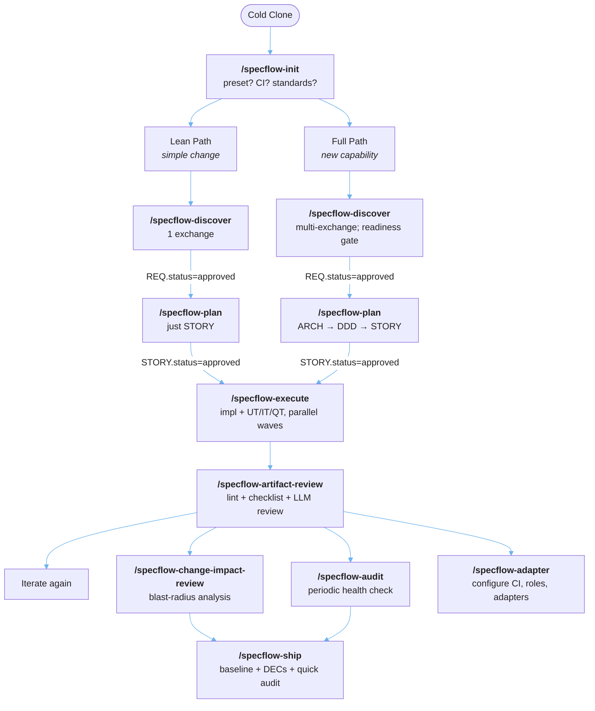

# SpecFlow 🚀

I want to help you MAKE PRODUCTION READY code easier. 

Compliance-grade spec tracking, without the portal.

*Why it matters* · *How it works*

May 7, 2026

<TitleQRCodes />

<!--
This is the title slide.
-->

---
layout: default
---

# My Pet Project: SpecFlow

It's my take on how we can make **production grade** codebase with LLM. 

- It's a framework with **BOTH**
  - 10 LLM SKILLS: `/specflow-command`
  - Application Lifecycle Management (ALM) software with `specflow checklist-run` like commands
- It's designed to:
  - easy to use 
  - scalable
  - help you build quality software (like compliance mindset) 
    - provide evidence here and there
  - open source

---
layout: default
---

# 🧗‍♀️ The Last Mile Problem

AI is amazing at 0-to-1, but struggles with **production-level codebases**.

- **Drift:** The further you get into a project, the harder it is to maintain context and consistency.
- **Poor Task Decomposition:** Prompting *"Build me an app that downloads data and trades stock for me"* fails because it's too vague.
- **Handling Design Changes:** If a document or design changes mid-flight, most AI frameworks don't dynamically adapt to these shifts. Consistency issue.
- **The Gap:** Files like `PRD.md` and `architecture.md` are steps in the right direction, but they lack rigid enforcement.
- **Transparency/ Quality Issue:** You don't know if your vibe-coded thing is safe to deploy. 

---
layout: default
---

# ⚖️ The Spectrum of AI Development

<DevelopmentSpectrum />

Many Many things have happened in between (they are NOT mutually exclusive): 
- TDD (Test-Driven Development), Role-based like agents, **Using Frameworks (spec-driven development)**
- Prompt Engineering, Context Engineering, Harness Engineering
- Indexing your codebase (e.g., [Graphify](https://graphify.net/)) 
- Memory, `SKILL.md`, MCP, tools, ...   

> In some sense, they all are about giving and managing **better** context. Like what to feed the LLM model, and in hope to get better output

---
layout: default
---

# 🏗️ Frameworks and Spec-Driven Development

By giving better specification, **Spec-driven development** is emerging as a popular approach to ground LLMs 

**Notable attempts in the wild:**
- [BMAD](https://github.com/bmad-code-org/BMAD-METHOD) (virtual role-based agile thing)
- [GStack](https://github.com/garrytan/gstack) (YC Garry Tan's, also some sort of agile virtual team thing)
- [SpecKit](https://github.com/github/spec-kit) (GitHub's constitution-driven approach)
- [GSD-2](https://github.com/gsd-build/gsd-2) 
- [Kiro Code from AWS](https://kiro.dev/) 
- ...

 

> **My Thesis**:
> - What they do = software development methodology  
> - These are great, but they still aren't *spec-ing* rigorously enough

---
layout: center
---

# ⚙️ The Solution: Process Engineering

To truly fix the last mile, we can't just rely on clever prompting or loose markdown files.

**KEY INSIGHT**: Things being messy and badly managed are NOT a new issue. We HUMANS were kinda the ORIGINAL SLOP, but we got the planes in the sky 

We must use **Process Engineering** and **Compliance** to rigorously ground the AI.

*It's time to build a system where the AI proves its work against the *law.*

---
layout: default
---

# 🧠 The Cognitive Shift: AI & Process

LLM coding is making us **SUPER FAST**. It offloads massive amounts of cognitive responsibility.

- **We are moving too fast**: We don't have the time to reflect, learn, or catch mistakes at the speed AI generates code. 
- **Focus on the Process, not the People**: Because the "human-in-the-loop" is good, but are you quick enough and fast enough? We must rely on a rigorous system to catch errors.
- **Spec-driven is NOT for every project**: It's not for quick Proof of Concepts (POCs). It is for important software where you actually know what you want to build.

 

PRDs ground a project, but **Specifications** level that up. By explicitly defining the *right and wrong* behaviors, we leave **less room for AI interpretation**.

---
layout: default
---

# 🏃 Agile

Agile means many things. It is excellent for iterative, consumer-facing products (like web apps). But *are you doing it right* in the AI era?

- **Agile has become mainstream:** Created for website development. MOVE FAST, increased flexibility, customer collaboration.
- **Core values of Agile:**
  - **Individuals and interactions** over processes and tools
  - Working software over comprehensive documentation
- **The AI Bottleneck (Context Loss):** Agile relies heavily on human communication, talent, and shifting context. When AI writes code at 10x speed, human context switching and communication become severe bottlenecks.
- **The Human-in-the-loop:** You are the experienced individual, but can you review and break down tasks fast enough before the AI generates thousands of lines of code?

---
layout: default
---

# 🆚 Agile (Scrum) vs V-model (or Waterfall) 

Agile and V-model solve fundamentally different problems.

- **People-Driven vs Process-Driven**: Agile relies on heroic, talented individuals. V-model relies on a rigorous system.
- **Iterative vs Upfront Rigor.**
- **Where V-model Shines (Safety & Security & Privacy):**
  - **Financial Apps** (Virtual Banks, High-Frequency Trading Platforms)
  - **Healthcare Technology**
  - **Automotive Systems**
- **Documentation**: Agile trusts working software over documentation. V-model requires provable, auditable traceability.

---
layout: default
---

# 📐 The V-Model Concept

It's an evidence-based approach to building software.

- **Systematic Decomposition:** Unlike Agile which focuses on user stories, the V-Model provides a structured way to break down complexity: **System → Modules → Units**.
- **Requirements as a Law Book:** Requirements are the law. Your architecture and design are simply the *evidence* that fulfills that law.
- **Evidence-Based Compliance:** When it comes to compliance, you must be able to prove *why* something works.
- **Perfect for LLMs:** This is why it works so well with AI. LLMs can generate the code, and the traceability chain provides the exact evidence that the AI followed the rules.

---
layout: default
---

# 🚗 If we were to make a car 

We wouldn't just "move fast and break things". We would use a V-model.

- **Systemizing Talent**: For safety-critical applications, we can't rely solely on an individual's heroics. We use processes to offload responsibility from the talented individual to the system. This is the essence of compliance.
- **Process Philosophy**: It relies entirely on **Traceability** and **Change Management**. Every requirement must be tested, and every line of code must trace back to a requirement. You cannot change code without changing the spec.
- **What REAL compliance looks like**: Curious how intense this gets? Check out the [Automotive SPICE Pocket Guide](https://www.ul.com/sites/default/files/2024-10/Automotive_Spice_Pocket_Guide.pdf).

---
layout: default
---

# 🏦 Example: A Financial App V-Model

How a single requirement fans out into a 1-to-many traceability chain:

**Requirement (REQ-001):** "Users must securely authenticate before transferring funds."
- **Architecture (ARCH-001):** OAuth 2.0 implementation for secure login.
  - **Design (DSGN-001):** Login screen UI components & state.
  - **Design (DSGN-002):** Auth provider integration logic.
  - **Test (IT-001):** Integration test for valid token generation.
- **Architecture (ARCH-002):** Rate-limiting middleware to prevent brute force.
  - **Design (DSGN-003):** Redis-based IP rate limiting logic.
  - **Test (UT-001):** Unit test verifying the 6th attempt is blocked.

*(1 REQ → 2 ARCH → 3 Designs + 2 Tests)*

---
layout: default
---

# 📈 Example 2: A Quant Trading System

Contrasting the vague *"make it fast"* prompt with a rigorous spec:

**Requirement (REQ-002):** "The system must process incoming market tick data and route a trade order within 50ms (p99 latency)."
- **Architecture (ARCH-003):** In-memory ring buffer for lock-free data ingestion.
  - **Design (DSGN-004):** UDP multicast listener module.
  - **Design (DSGN-005):** Lock-free circular buffer implementation.
  - **Test (PT-001):** Performance test asserting ingestion latency < 10µs.
- **Architecture (ARCH-004):** Event-driven trade execution state machine.
  - **Design (DSGN-006):** Order routing state transition logic.
  - **Test (IT-002):** Integration test verifying state transitions under load.

*(1 REQ → 2 ARCH → 3 Designs + 2 Tests)*

---
layout: default
---

# 💡 The SpecFlow Philosophy. What it is?

**Process-driven R&D: Compliance as Code + LLMs**

- **Development Methodology is Needed, and spec(requirement)-driven is nice**: We don't just write code; we write specifications that enforce what the code should do. This bridges the gap, allowing LLMs to safely write production-level code.
- **Handbook Generation:** If you have that 100-page handbook for ANY project in ANY domain, you probably will have a much better **chance** to success.
- **ALMs are a By-Product**: Traditional Application Lifecycle Management (ALM) portals are just a side-effect of needing this process. We don't need the heavy portal; we just need the rigor.
  - **Your Git Repo is the Database**: Markdown & YAML. All specs, tests, and audits live natively in your repository.
- **Seamless Experience and Easy to Use:** 10 `/specflow-command` where the agents ask you questions to set up the requirements and your designs!

---
layout: default
---

# 🌊 Vibe-Compliance & Impact Analysis

- **Grounding the LLM:** By having AI help define and clearly document requirements upfront, we create a strict "law" that grounds the LLM, drastically reducing the risk of code drift or "hallucinations".
- **The Reality of Change:** It's completely okay if you realize later that your initial "law" or design needs changing! Development is about learning.
- **Robust Paper Trail:** SpecFlow maintains a clear history. When a requirement changes, the tool shows its paper trail and performs a blast-radius impact analysis. 
- **Adaptable Designs:** This allows you to confidently see what downstream architecture or code needs adjusting, making your foundational designs robust and adaptable over time.

---
layout: default
---

# 🔄 The SpecFlow Lifecycle

```mermaid {theme: 'base'}
%%{init: {'themeVariables': { 'lineColor': '#6CB4EE', 'edgeLabelBackground': '#ffffff', 'textColor': '#222222'}}}%%
graph TD
    Start([Cold Clone]) --> Init[<b>/specflow-init</b><br/>preset? CI? standards?]
    
    Init --> Lean[Lean Path<br/><i>simple change</i>]
    Init --> Full[Full Path<br/><i>new capability</i>]
    
    Lean --> DiscLean[<b>/specflow-discover</b><br/>1 exchange]
    Full --> DiscFull[<b>/specflow-discover</b><br/>multi-exchange; readiness gate]
    
    DiscLean -- REQ.status=approved --> PlanLean[<b>/specflow-plan</b><br/>just STORY]
    DiscFull -- REQ.status=approved --> PlanFull[<b>/specflow-plan</b><br/>ARCH → DDD → STORY]
    
    PlanLean -- STORY.status=approved --> Exec[<b>/specflow-execute</b><br/>impl + UT/IT/QT, parallel waves]
    PlanFull -- STORY.status=approved --> Exec
    
    Exec --> Review[<b>/specflow-artifact-review</b><br/>lint + checklist + LLM review]
    
    Review --> Iterate[Iterate again]
    Review --> Impact[<b>/specflow-change-impact-review</b><br/>blast-radius analysis]
    Review --> Audit[<b>/specflow-audit</b><br/>periodic health check]
    Review --> Adapter[<b>/specflow-adapter</b><br/>configure CI, roles, adapters]
    
    Impact --> Ship[<b>/specflow-ship</b><br/>baseline + DECs + quick audit]
    Audit --> Ship
```

---
layout: default
---

# 🛠 The 10 Core Commands

The day-to-day product interface for managing your specs and code.

<CommandsTable />

 
- *And there are more deterministic CLI commands like `specflow status` or `uv run specflow status` to check your project health.* 

---
layout: center
---

# 🤖 Supported Assistants

SpecFlow runs wherever you do.

- **Claude Code**
- **Cursor**
- **Gemini CLI**
- **Cline**, Windsurf, OpenCode, Copilot, Roo, QwenCoder... 

 

> *"If your assistant can read files and run scripts, it can run SpecFlow."*

---
layout: default
---

# 📝 My Advices on How to Be Better at AI coding or just Write Better Structured Prompts

LLM is powerful, but you ?sort of? set the ceiling on how high it can go

- Do NOT rush things
- **MUST Do a BETTER JOB** on task DECOMPOSITION
- Track your TODO, and changes in REQ, Design, etc
- Get some Best Practices/ Common Pitfalls/ Checklist for you to learn, and ensure the LLM does *good work 
- Communicate better, like less room for interpretation errors 
  - Some tasks have clear **Correct or Wrong**. Some don't. Best act accordingly.

---
layout: center
class: text-center
---

<!-- 
NOTE: We prefer to abstract away complex HTML/divs into Vue components (like we did with global-bottom.vue). 
For the sake of simplicity on this Q&A slide, we are keeping the inline divs, but in the future, these should be moved to a custom <QRCode /> component. 
-->

# 🎤 Q & A

Thank you! Name is, Long Hui. Long from Hong Kong

<QnAQRCodes />

